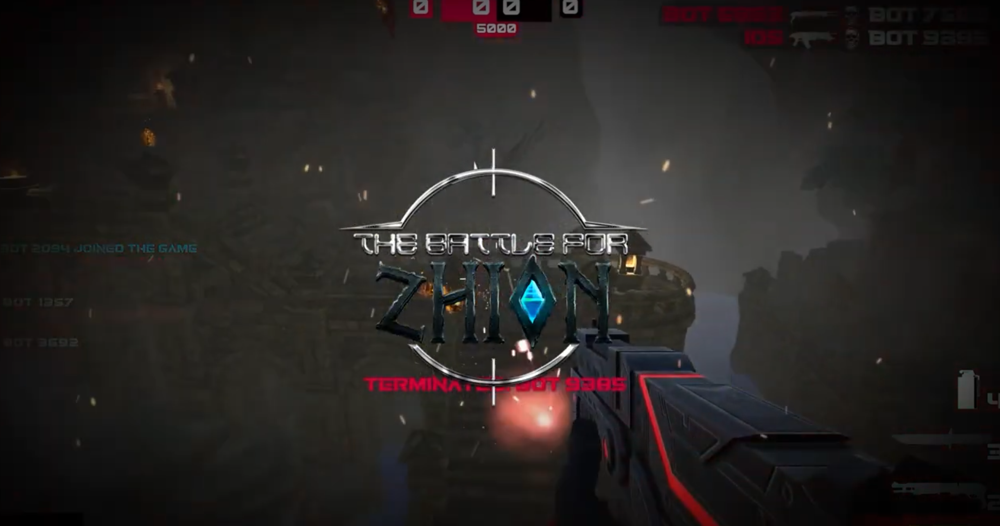
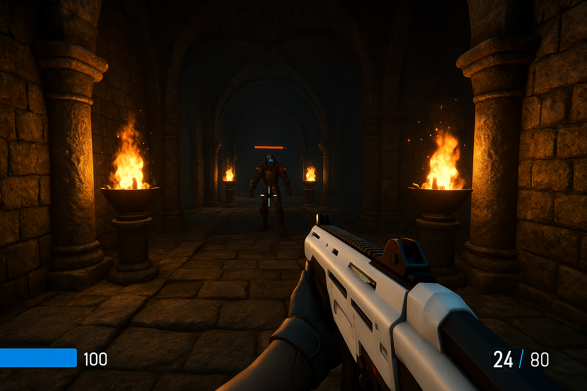

# 🕹️ The Battle for Zhion



**The Battle for Zhion** es un videojuego multijugador **First-Person Shooter (FPS)** desarrollado por [Inside Dark Studio](https://insidedarkstudio.com), pensado para ejecutarse directamente desde navegador con integración Web3 mediante la blockchain de Internet Computer (ICP).

Este repositorio contiene el código fuente, recursos y documentación técnica para desarrolladores y colaboradores del estudio.

---

## 🚀 Estado del Proyecto

- 🟢 MVP funcional
- ✅ Modo Deathmatch implementado
- 🔄 Iteraciones en UI y animaciones
- 🔜 Próximamente:
  - Modo Battle Royale
  - Progresión de jugador
  - Integración completa con canisters NFT
  - Versiones multilingüe

## 🎮 Gameplay Preview



---

## 📁 Estructura del Proyecto

/Source/ # Código principal del juego (Unreal Engine)
/Content/ # Assets del juego (modelos, sonidos, animaciones, UI)
/Config/ # Archivos de configuración y builds
/Frontend/ # HUD, menús y lógica Web/UI si aplica
/Scripts/ # Utilidades y herramientas de desarrollo
/Docs/ # Documentación y lineamientos técnicos

---

## 🧰 Requisitos Técnicos

- **Motor**: Unreal Engine 5.x
- **Lenguajes**: C++ + Blueprints
- **Multiplayer**: Replicación nativa de UE5 + lógica personalizada
- **Web3**: Canisters de Internet Computer (ICP)

---

## 🛠️ Configuración local

1. Clonar el repositorio:
   ```bash
   git clone https://github.com/InsideDarkStudio/the-battle-for-zhion.git


2. Abrir el archivo .uproject en Unreal Engine 5.6

3. (Opcional si usás C++):
    ./GenerateProjectFiles.bat
    ./Build.bat

4. Ejecutar en el editor (Play in Editor) o empaquetar desde:
File > Package Project

---

🧪 Testing
Pruebas internas: modo multiplayer local (PIE)

Testing Web3: entorno dfx local con mock de identidad

Integración con HUD y login se encuentra en /Frontend/Widgets

---

👥 Equipo

🎯 Mariano Stoll – Director General

🧠 Francisco Rappazzini – CTO (Chief Technology Officer)

🧩 Francisca Nicole Morales Calquín – COO (Chief Operating Officer)

🎮 Lautaro Padró – Game Designer

🎨 Lucía Mamut – Game Art Designer

---

🧭 Roadmap (Q3 2025)
 Optimización del Netcode para 60+ jugadores

 Integración Battle Royale

 Canje de NFTs en inventario

 Localización al español, inglés y portugués

 Animaciones dinámicas vía blueprints

 ---

📄 Licencia
Este proyecto es propiedad de Inside Dark Studio.
No se permite su distribución ni uso comercial sin autorización expresa.