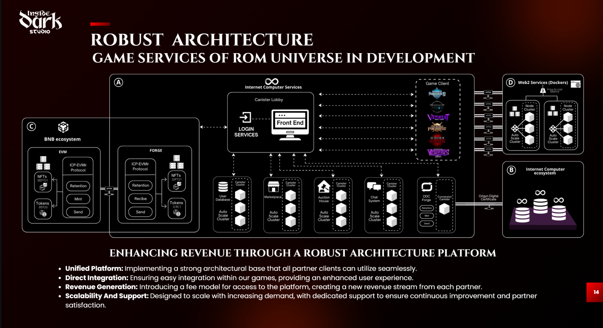

# 🕹️ The Battle for Zhion (TBFZ)


**The Battle for Zhion** is an **FPS / Battle Royale** that is part of the **Reality of Madness** game suite.  
Developed by **Inside Dark Studio** using **Unreal Engine 5**, it is designed for PC (and future Web builds) with **Web3 interoperability through Chain Fusion**.

- Studio: https://insidedarkstudio.com
- Universe site: https://realityofmadness.com
- Docs: https://docs.realityofmadness.com
- Discord: https://discord.gg/byYXnpyp

---

## 🚀 Project Status
- 🟢 Playable MVP (Deathmatch)
- 🔧 HUD and UX iteration
- 🔗 Initial database & login bridge to ICP
- 🔜 Upcoming: **Battle Royale mode**, progression systems, NFT inventory, and multilingual localization

---

## 🎮 Core Features
- First-person shooter based on **Lyra Starter Game** with modular gameplay extensions
- Modes: **Deathmatch**, **Battle Royale**, and limited-time **PvE Events**
- Inventory and **Favorite Character selection**, persistent profiles
- **HUD** bridge for login, character, and chain-linked assets
- **Chain Fusion** interoperability: ICP as the **main database**, with support for reading/writing assets across **Ethereum, Solana, Polygon, and others**
- Pipelines for **Windows build** and cinematic exports

---

## 🧱 Folder Structure (UE5)
```
/Config/                         # Project settings & builds
/Content/                        # Assets & maps
  /Characters/                   # Meshes, animations, data assets
  /Environments/                 # Maps: SkyTown, CyberPunkKyiv, Village, Cave_Ruins, etc.
  /Weapons/                      # Firearms, melee, VFX, sounds
  /UI/                           # HUD, widgets, fonts & icons
  /VFX/                          # FX packs (BlinkAndDashVFX, Realistic_Starter_VFX_Pack, etc.)
  /IDS_ASSETS/                   # Proprietary Inside Dark Studio assets
  /Sequences/                    # Sequencer animations & renders
  /Audio/                        # SFX & music
  /Feedback/                     # Gameplay notifications/messages
  /Heart/                        # Core maps and prototypes
/Plugins/                        # Required plugins
/Source/                         # C++ code (if used)
/docs/                           # Documentation & guides
TheBattleForZion.uproject        # Main UE5 project
```

---

## 🔌 Plugins & Marketplace Content
**Required UE Plugins**
- `AsyncMixin`, `CommonGame`, `CommonLoadingScreen`, `CommonUser`
- `GameFeatures`, `GameSettings`, `GameSubtitles`
- `GameplayMessageRouter`, `ModularGameplayActors`
- `LyraExampleContent`, `LyraExtTool`, `PocketWorlds`
- `UIExtension`

**Marketplace Packs**
- Sky/Environment: `UltraDynamicSky`, `Village`, `SoulCave`, `CyberPunkKyiv`, `Sci_Fi_Valley_Village`, `Cave_Ruins`, `BrutalistLevelKit`
- VFX: `BlinkAndDashVFX`, `ContextEffects`, `GameplayCueNotifies`, `Realistic_Starter_VFX_Pack_Vol2`, `MegaMagicVFXBundle`
- Animations: `Samurai_Animation`, `Sword_Animation`
- Props: `Horror_Props`, `Statue`, `WoodMaterialPack`

> If any package is missing, use UE placeholders to compile and test.

---

## 🧰 Requirements & Stack
- **Engine:** Unreal Engine **5.3+** (developed/tested on 5.6)
- **Languages:** Blueprints + C++ (for network/bridge logic)
- **Networking:** UE native replication + custom matchmaking state logic
- **Web3/Chain Fusion:** ICP as persistent database, with **cross-chain fusion** to interact with other chains (EVM & non-EVM)
- **CI/CD:** Build pipelines & MoviePipeline for renders

---

## ⚙️ How to Build & Run
1. Clone the repository:
```bash
git clone <REPO_URL>
```
2. Open `TheBattleForZion.uproject` in UE5 (5.6 recommended).
3. If using C++:
```bash
./GenerateProjectFiles.bat
./Build.bat
```
4. Run in editor (PIE) or package:
```
File → Package Project → Windows
```

---

## 🌐 Chain Fusion (Web3 Integration)
- **ICP (Internet Computer):** used as the **core decentralized database**
- **Cross-chain interoperability:** Bridge to **Ethereum, Solana, Polygon, Bitcoin, and more**
- **Profiles & Favorites:** Player data and persistence stored on ICP, synced with in-game assets
- **NFTs & Tokens:** Reading/writing across multiple chains through **Chain Fusion APIs**
- **Local Dev:** `dfx start` for ICP + testnets for external chains

> This architecture makes TBFZ a **truly interoperable Web3 FPS**, not bound to a single blockchain.

---

## 🌐 Repo Communication Canister: 

https://github.com/idarkstudio/UN-LOGIN-IC-IDS

---

## 🧪 Testing
- Local multiplayer (PIE with multiple windows)
- HUD and state replication validation
- QA for combat animations (melee + firearms)
- Cross-chain inventory simulation (mock ICP + EVM testnets)

---

## 👥 Core Team
- **Mariano Stoll** — General Director
- **Francisco Rappazzini** — CTO
- **Francisca Nicole Morales Calquín** — COO
- **Lautaro Padró** — Game Designer
- **Lucía Mamut** — Game Artist

---

## 🗺️ Roadmap (Q3–Q4 2025)
- Optimize netcode for 60+ players
- Release **Battle Royale** mode (circle mechanics, respawn, loot system)
- Enable **NFT redemption & cosmetics** through Chain Fusion
- Localization in **English, Spanish, Portuguese**
- Animation and blending improvements

---

## 📫 Communication Channels
- **Issues & Tasks:** GitHub Projects board
- **Developer Support:** #dev-support channel in **Discord**
- **Press/Business:** via studio websites

---

---

## 🏗️ Architecture Overview

The **Reality of Madness (ROM) Universe** and **The Battle for Zhion (TBFZ)** are built on a **robust multi-chain architecture**, combining the power of the **Internet Computer (ICP)** with **Chain Fusion interoperability**.

### Key Components
- **ICP as Core Database Layer**:  
  ICP canisters store **user profiles, assets, inventory, and gameplay states**. This ensures decentralization, security, and persistence at scale.
- **Chain Fusion Bridges**:  
  Through our **FORGE protocol**, ROM enables NFTs and tokens to flow between ICP and external ecosystems like **Ethereum, Solana, Polygon, and BNB Chain**.
- **Game Client Integration**:  
  Games like **The Battle for Zhion** connect directly to the canister lobby for login, matchmaking, inventory, and asset management.
- **Web2 Services**:  
  Non-blockchain services (e.g., rendering, CDN, analytics) are managed via **scalable Docker clusters** integrated with the ROM ecosystem.

### Features
- **Unified Platform**: All ROM games share the same underlying infrastructure.  
- **Direct Integration**: Seamless login, asset sync, and cross-chain support inside each game client.  
- **Revenue Generation**: Marketplace and auction house fees feed back into the ecosystem.  
- **Scalability**: Auto-scaling clusters for database, chat, auction, and matchmaking services.  

---

## 📊 Architecture Diagram



> This diagram illustrates the **multi-chain, ICP-based architecture** of ROM Universe.  
> The Battle for Zhion leverages this structure to deliver an **FPS/Battle Royale with true Web3 interoperability**.


## 📄 License
Property of **Inside Dark Studio**.  
No commercial use or redistribution allowed without prior authorization.


